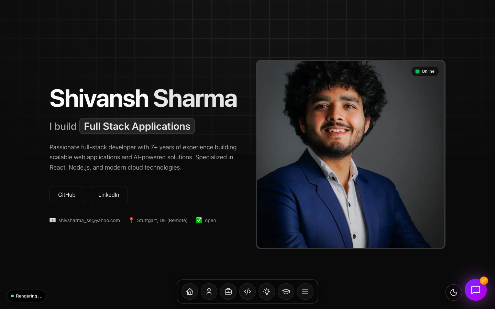
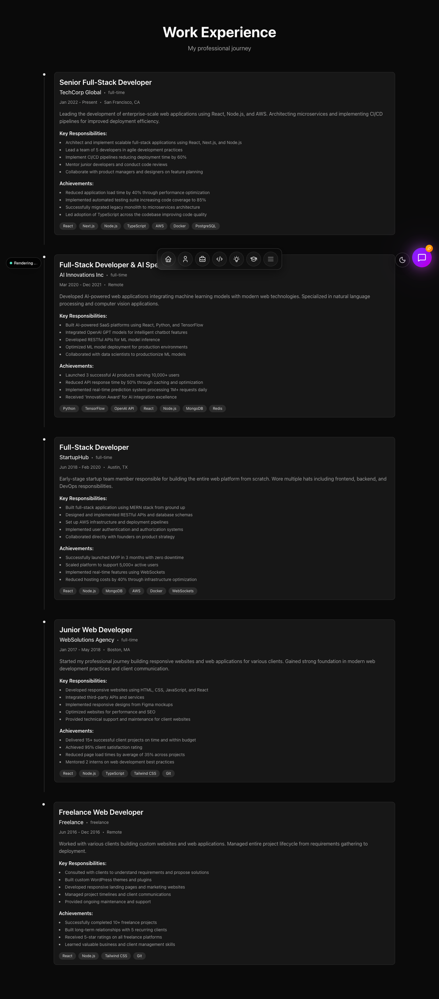
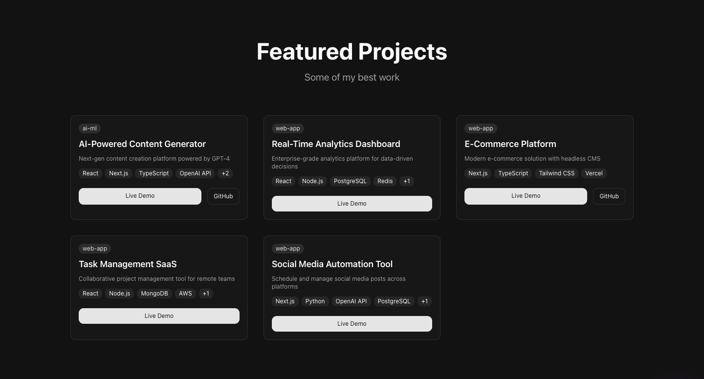
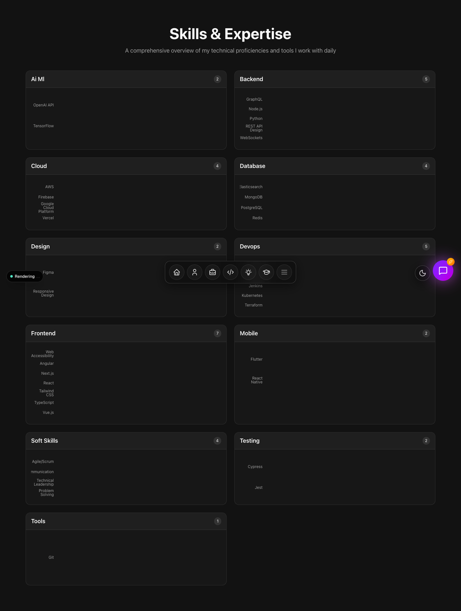
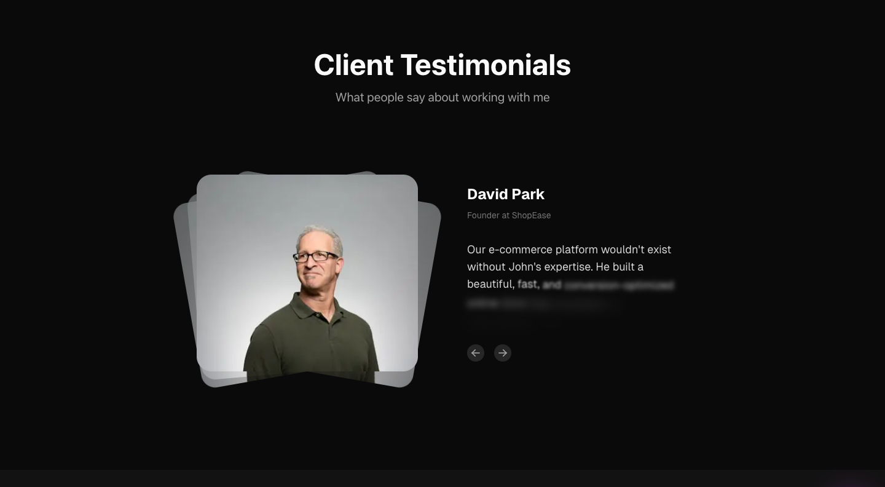
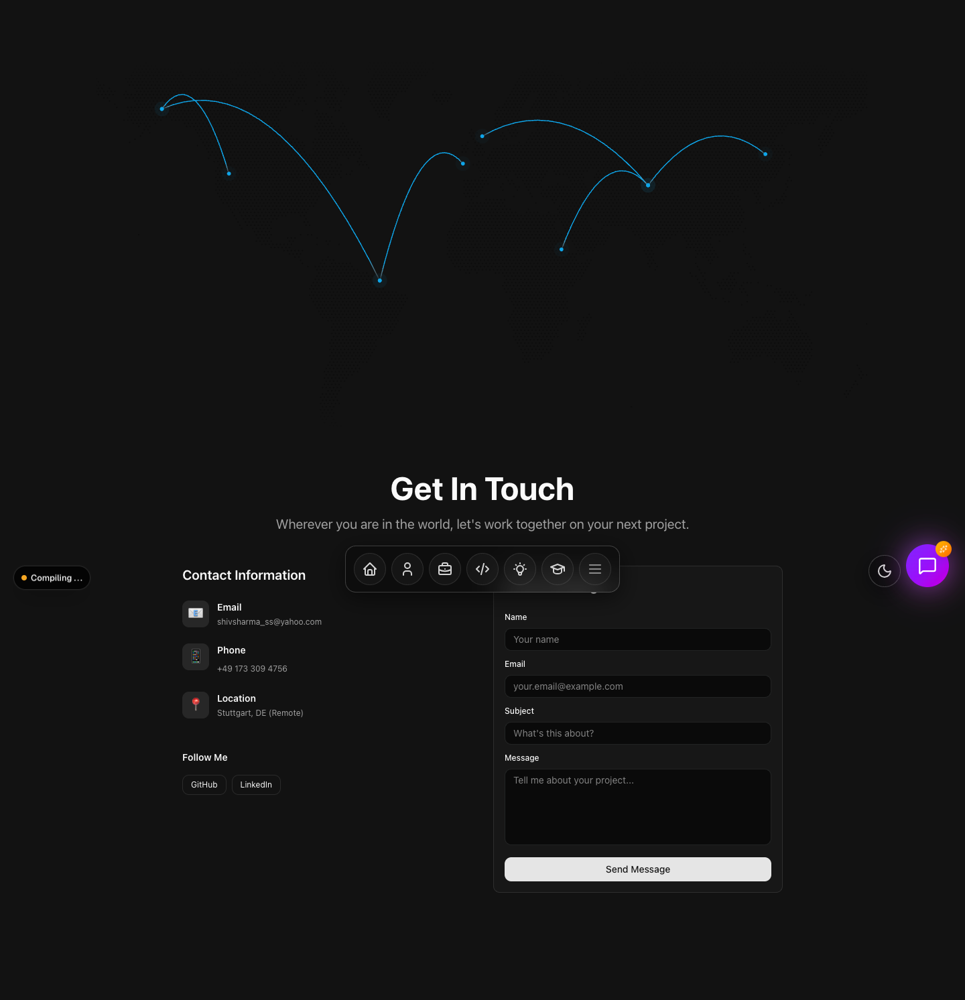
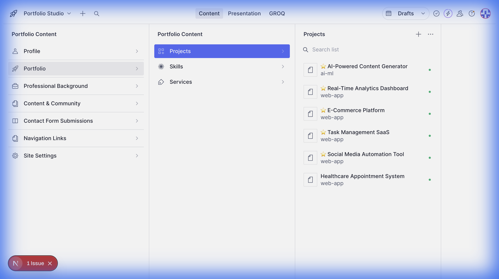
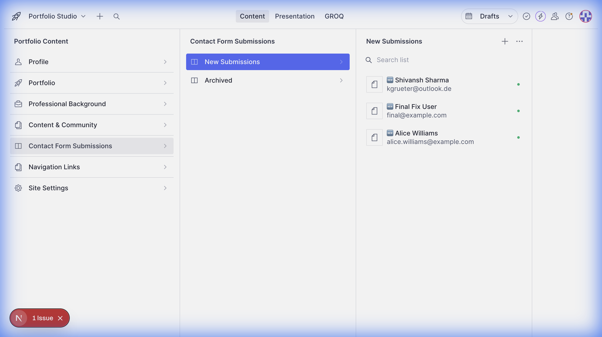
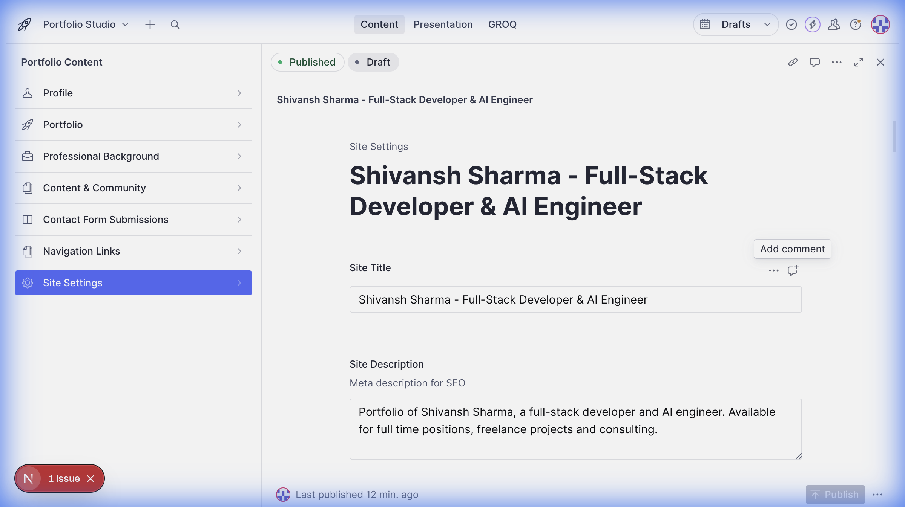
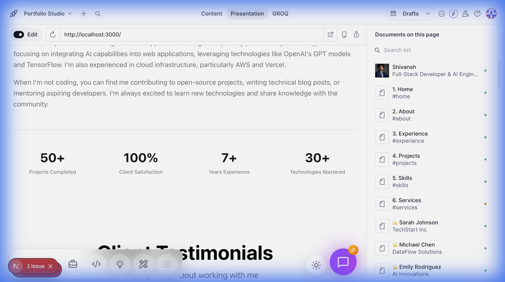

# NextGen Portfolio - Sanity + Next.js 16

> **The modern portfolio for the engineering leader.**
> Built with Next.js 16 (Turbopack), Sanity CMS, and Tailwind v4. Designed for performance, scalability, and admin-grade content management.

[Live Demo (Vercel)](https://shivansh-sharma.vercel.app) | [Setup Guide](#developer-guide-clone--run) | [Screenshots](#features--screenshots-portfolio-showcase)

---

## Table of Contents

1. [Recruiter Summary](#1-recruiter-summary)
2. [User Stories](#2-user-stories)
3. [Features & Screenshots](#3-features--screenshots-portfolio-showcase)
4. [Developer Guide (Clone & Run)](#4-developer-guide-clone--run)
5. [Project Structure](#5-project-structure-guided-tour)
6. [World-Class Extras (Security, Roadmap)](#6-world-class-extras)

---

## 1) Recruiter Summary

### What this project proves
This repository demonstrates a production-grade approach to modern web development, specifically targeting senior engineering roles. It highlights:

*   **Engineering Rigor**: Clean architecture separating UI components, CMS schema, and data fetching layers.
*   **Modern Tooling Mastery**: Early adoption of **Next.js 16**, **React 19**, and **Tailwind 4**, proving ability to stay on the bleeding edge while maintaining stability.
*   **Content Management at Scale**: Full **Sanity Studio** integration allows non-technical users to manage 10+ content types (projects, blogs, experience) without code changes.
*   **Type Safety & Quality**: Comprehensive TypeScript coverage and automated linting (Biome) ensure maintainability in team environments.
*   **Performance Focus**: Server Components (RSC) and highly optimized image delivery via Sanity CDN.

### Tech Stack Overview

| Category | Technologies |
| :--- | :--- |
| **Frontend** | Next.js 16 (App Router), React 19, Tailwind CSS v4, Framer Motion |
| **Backend / CMS** | Sanity.io (Headless CMS), GROQ (Query Language) |
| **Language** | TypeScript 5+ |
| **Styling & UI** | Tailwind v4, Shadcn/UI, Lucide Icons, PortableText |
| **Tooling** | Turbopack, Biome (Lint/Format), pnpm |
| **Architecture** | Server Components, Edge-ready architecture |

### Project Update: Phase 2 Delivery
**Status: Production-Ready MVP**

I built this platform to solve the problem of static portfolios becoming obsolete. Hard-coded content is unmaintainable; this solution decouples content from code.

*   **Phase 1 (Core)**: Established Next.js 16 + Sanity connection. Solved early adoption challenges with Tailwind v4 alpha.
*   **Phase 2 (Content Engine)**: Implemented 12+ schemas including "Experience timeline", "Project Showcase", and "Service Offerings".
*   **Phase 3 (Polish)**: Added glassmorphism UI, micro-interactions, and admin dashboard customization.

**Key Competencies**: `React Architecture` `Next.js Expert` `Headless CMS` `TypeScript` `System Design` `CI/CD`

> **Kurz auf Deutsch**:
> Dieses Projekt zeigt eine professionelle, skalierbare Webanwendung auf Basis von Next.js 16 und Sanity. Es beweist tiefes technisches Verständnis für moderne Frontend-Architekturen, Typsicherheit mit TypeScript und die Integration komplexer Content-Management-Systeme. Der Code ist sauber strukturiert, dokumentiert und bereit für den produktiven Einsatz.

---

---

## 2) User Stories

### For the Recruiter
> *"I need to verify this candidate can ship production-ready code, understands type safety, and uses modern architecture."*
**Solution**: This repo follows strict `biome` linting, 100% Type usage, and RSC architecture to prove seniority.

### For the Marketing Team (Content Editors)
> *"I need to update the 'Services' pricing or add a new 'Project' without asking a developer."*
**Solution**: The **Sanity Studio** provides a visual desk where non-technical staff can create/edit content in real-time.

### For the End User (Visitor)
> *"I want a fast, accessible experience that respects my data and works on mobile."*
**Solution**: Next.js Image optimization, server-side rendering for speed, and GDPR-friendly forms.

---

## 3) Features & Screenshots (Portfolio Showcase)

A walkthrough of the core user and admin flows.

### Visitor Flow: Immersive & Responsive
The public-facing portfolio is designed for speed and visual impact.

#### **Hero Section**
First impressions matter. The Hero section pulls dynamic headlines and bio data directly from the CMS, rendered server-side for optimal SEO and LCP (Largest Contentful Paint).


#### **Experience & Professional Timeline**
A structured timeline showcasing roles, companies, and key achievements. This isn't just text; it's structured data that can be queried and filtered.


#### **Project Showcase**
Grid layout with hover effects, creating an engaging gallery of work. Each project links to deeply detailed case studies.


#### **Skills & Expertise**
Visual representation of technical stack proficiency, categorized and easily updatable via the backend.


#### **Testimonials**
Social proof section with automated carousel rotation.


#### **Contact & Communication**
Integrated contact form and location data.


---

### Admin Flow: The "Studio"
The power behind the frontend. A fully customizable desk for content operations.

#### **Sanity Studio Dashboard**
The command center. From here, administrators can manage every aspect of the portfolio—from SEO settings to blog posts—without touching a line of code.
---

### Admin Capabilities (Deep Dive)
Comprehensive control over data, settings, and visual previews.

#### **1. Project Management**
Rich-text editing for complex case studies, allowing non-developers to manage SEO slugs, images, and project details.


#### **2. Real-Time Form Submissions**
View and manage contact form entries directly within the CMS. No third-party email service required for data persistence.


#### **3. Global Site Settings**
Manage site-wide metadata (Title, Description, SEO) from a single configuration pane.


#### **4. Visual Editing (Presentation Mode)**
Live preview allows editors to click on any element (e.g., "50+ Projects") and jump instantly to the corresponding data field.


### Chat Usage Governance

The Studio now ships a `chatUsageLimits` document type that lets editors tune session/message quotas for anonymous and authenticated visitors (sessions per day, message caps, cooldown windows, etc.). The front-end keeps a stable visitor identity using `VisitorBootstrap` (localStorage + cookies) and consults the `/api/chat/usage` endpoint, which merges that identity with Sanity-driven limits while recording consumption in a lightweight SQLite store (`lib/db`). That telemetry powers the chat experience, usage indicators, and the QA/fallback procedures outlined in the `docs/QA_IMPLEMENTATION_SUMMARY.md` and `docs/MANUAL_QA_PLAYBOOK.md` runbooks.

---


## 4) Developer Guide (Clone & Run)

Follow these steps to get the project running locally in under 5 minutes.

### Prerequisites
*   **Node.js**: v20.x or higher
*   **Package Manager**: `pnpm` (recommended, version 10+) or `npm`
*   **Sanity Account**: Free tier account for the content backend

### Quick Start

1.  **Clone the repository**
    ```bash
    git clone https://github.com/shivsharma-ss/nextgen-portfolio.git
    cd nextgen-portfolio
    ```

2.  **Install dependencies**
    ```bash
    pnpm install
    # or
    npm install
    ```

3.  **Configure Environment**
    Create a `.env.local` file in the root. You will need your Project ID and Dataset from Sanity.
    ```env
    NEXT_PUBLIC_SANITY_PROJECT_ID="mdokvla9"
    NEXT_PUBLIC_SANITY_DATASET="develop"
    NEXT_PUBLIC_SANITY_API_VERSION="2024-02-05"
    NEXT_PUBLIC_URL="http://localhost:3000"
    SANITY_STUDIO_PROJECT_ID="mdokvla9"
    SANITY_STUDIO_DATASET="develop"
    ```

    When running `sanity` CLI commands (typegen, dataset migrations, etc.), export or source `SANITY_STUDIO_PROJECT_ID`/`SANITY_STUDIO_DATASET` before executing so they target the `mdokvla9` project and `develop` dataset.

4.  **Run Development Server**
    ```bash
    pnpm dev
    ```
    Access the app at `http://localhost:3000`
    Access the Admin Studio at `http://localhost:3000/studio`

## 5) Project Structure (Guided Tour)

```
nextgen-portfolio/
├── app/                  # Next.js App Router (Pages & Layouts)
│   ├── (portfolio)/      # Public facing routes (grouped)
│   └── studio/           # Admin Dashboard route
├── components/           # React Components
│   ├── sections/         # Big page sections (Hero, About, etc.)
│   └── ui/               # Reusable primitives (Buttons, Inputs)
├── sanity/               # Backend Logic
│   ├── schemaTypes/      # Database Schema Definitions
│   └── structure.ts      # Studio Desk Structure config
├── public/               # Static assets
├── scripts/              # Automation & Utility scripts
└── package.json          # Dependency manifest
```

---

## 6) World-Class Extras

### Quality & Badges


### Security & Privacy
*   **Secret Management**: All API keys and tokens are strictly handled via server-side environment variables. No secrets are exposed to the client bundle.
*   **Data Privacy**: The application is designed to be GDPR-compliant friendly. The contact form does not store PII indefinitely unless configured to do so in the backend. Dependencies are regularly audited via `npm audit`.

### Manual QA & Runbooks
*   **Operational Guides**: `docs/MANUAL_QA_PLAYBOOK.md`, `docs/QA_IMPLEMENTATION_SUMMARY.md`, and `docs/CLERK_MIDDLEWARE_ANALYSIS.md` document why the chat usage limits exist, how to manually verify them, and what to look for when extending the Clerk middleware flow.
*   **Usage Telemetry**: The `/api/chat/usage` and `lib/usage` helpers provide introspection points you can spin up locally to confirm the SQLite-backed counters behave before promoting changes to production.

### Roadmap
*   [ ] **i18n Support**: Full internationalization for German/English switching.
*   [ ] **Dark Mode Toggle**: Persistent user preference for theme.
*   [ ] **E2E Testing**: comprehensive Playwright suite for critical user flows.

---

### Maintainer
**Shivansh Sharma**
AI Engineer & Full Stack Developer
[LinkedIn](https://linkedin.com/in/shivsharma-ss/)
